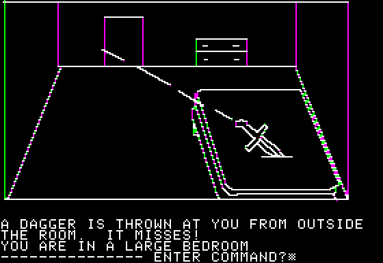
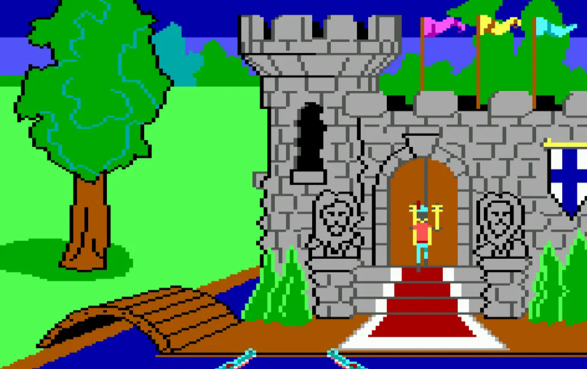
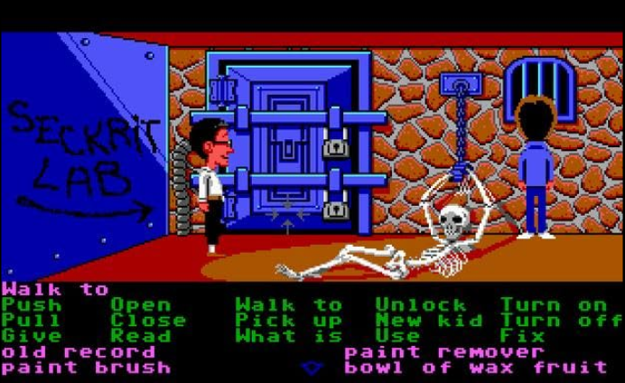

# WORLDBUILDING AND EARLY ADVENTURE GAMES

## Thoughts on The Quiet Year?
- What were your thoughts on the game? 
- How did the rules and mechanics of the game encourage storytelling for you?

## Early graphical adventure games
In the mid-to-late 80's, one of the most dominant forms of computer game was the graphic adventure game, sometimes also known as _point-and-click_ adventures because of the dominant form of interaction.

These games built on the existing genres of text-based adventure games and became incredibly popular as personal computers became more widespread.

Two of the pioneers in this space were Sierra On-Line and LucasFilm Games (aka LucasArts).

### Sierra On-Line
Sierra was an early computer game pioneer founded in 1979 by the husband-and-wife duo Ken and Roberta Williams. Originally imagined as an enterprise software company, Sierra went on to become one of the most prolific and financially successful producers of early commercial computer games.

#### Hi-Res Adventure #1: Mystery House, 1980
- The game is a spooky murder mystery that takes place in an abandoned Victorian-era house.
- It was the first adventure game to have full-color graphics in addition to parser-style game play.
- It was a commercial success, initially selling over 15,000 copies via mail order and earning $167,000 (equivalent to $593,000 in 2022). On re-release in 1982, it went on to sell another 60,000 copies!
- The game is inspired by the classic board game Clue and is considered one of the first horror videogames.
- You can play this emulated online [here](https://archive.org/details/Hi-Res_Adventure_1_Mystery_House_1980_On-Line_Systems)

#### King's Quest, 1984
- In this game, you are a knight on a quest to find hidden treasures with the promise of becoming king.
- Arguably, Sierra On-Line's most significant adventure game series.
- It featured 16-color graphics and was the first adventure game to integrate graphical animation into the game world.
- The initial release was controlled completely with textual input.
- It was re-released and repackaged a number of times, each with additional refinements such as mouse support, expanded backstory, and improved graphics.
- You can play an emulated version of the re-released game [here](https://archive.org/details/msdos_Kings_Quest_I_-_Quest_for_the_Crown_1987)

### LucasFilm Games
LucasFilm Games was founded in 1982 as a videogame development group alongside his film company. In the 1990s, LucasFilm Games (later known as LucasArts) became known as a leading producer of humorous adventure games based on its SCUMM engine. Members of LucasArts' early team went on to form a number of other game companies, most notably Double Fine (Psychonauts, Broken Age)

#### SCUMM
- SCUMM (Script Creation Utility for Maniac Mansion) was a game engine created by Ron Gilbert of LucasArts to simplify to development of graphical adventure games.
- It was created in response to the the King's Quest text parser, which Gilbert did not like.
- The interface originally consisted of roughly 40 different input commands, but ultimately was edited down to 12
- The systems designed with the tool contributed to the particular identifiable feeling of early LucasArts adventure games.

#### Maniac Mansion, 1987
- Maniac Mansion is a comedy-horror adventure game conceived of by Ron Gilbert and Gary Winnick, set in a haunted house and inspired by horror films and B-movie cliches.
- It features nonlinear puzzle design, so that the game can be played through in a variety of different ways. 
- Maniac Mansion was not a huge commercial success, though it is critically acclaimed and widely considered a cult classic in videogames.
- Maniac Mansion introduced a number of innovative ideas into adventure games, including multiple possible endings, user-selectable characters with unique skills, and cut scenes.
- Original game pitch document ([link](https://grumpygamer.com/maniac_mansion_design_doc))
- Ron Gilbert's GDC post-mortem talk ([link]())

#### Other Notable Games
- [The Secret of Monkey Island](https://www.youtube.com/watch?v=7YnuiM9HOoM), 1990
- [Loom](https://www.youtube.com/watch?v=7o2elJLEWA8), 1990
- [Grim Fandango](https://www.youtube.com/watch?v=kcqj0APsDsM), 1998

## Discussion Groups: Maniac Mansion
- Break into small groups to discuss the game you played for homework
- Use the discussion question that you came up with for homework as starting points
- Share highlights of your discussion out with the class

## Common critiques of classic graphical adventures
1. Clunky interfaces (Sierra's text parsers, LucasArt's SCUMM interface)
2. Unfair difficulty (often possible to make a choice without realizing that it would later be a game-ending mistake)
2. Over-reliance on "pixel hunting" (scouring the screen for interactable objects without any hints or cues)
3. Save SCUMMing (reliance on excessive saving to reverse undesired outcomes)

## Worldbuilding
Worldbuilding is the process of constructing an imaginary setting with coherent qualities such as geography, history, and culture. It typically involves the creation of things such as backstory, inhabitants, architecture, flora and fauna, in order to understand the key relationships in the world. These 

In games, worldbuilding guides your choices as a gameplay designer/artist/narrative designer/animator/level design etc. __Not all of the information you create about your world will be shared directly with a player.__

### Worldview vs Storyview
The _worldview_ is all of the information you have about the setting you are creating as a designer. You will always know more about the world you are designing than a player.

The _storyview_ is what a player knows about the world you have designed. 

The differences between these two viewpoints can be a powerful tool for storytelling.

### Primary World vs Secondary World
You will often hear the term "secondary world" referred to when discussing worldbuilding. The term comes from JRR Tolkein's distinction between the real world (primary world) and the author's imagination (secondary world).

### Top-down vs Bottom-up
There are two methods of world-building: _top-down and bottom-up_.

Top-down worldbuilding starts with a general overview such as geographic layout, climate, history, and inhabitants, and then becomes more and more detailed. Everything starts with a wide lens and zooms in.

Bottom-up worldbuilding starts with the specific location, which is developed in great detail. Over time, the world is developed around this focal point.

Neither is inherently better than the other, but the viability of each approach is relative to your project's needs.

### Characteristics of a well-realized setting
- The setting exhibits __coherent and consistent logic__ (the details of the world fits together)
- The setting has a built-in __wider cause and effect__ (we understand motivations because of the larger historical/societal context)
- Good __strategic use of specific details__ (not contradictory or jarring)
- The setting impacts character's lives in surprising and interesting ways.
- The setting __mirrors our real world but also deviates from it__
- The setting is __somehow personal to you__ (focused on what makes a setting meaningful to you)
- The setting has sufficient __mystery and unexplored vistas__ (the unknown world provides a sense of adventure and discovery, while knowing everything feels boring)
- The setting __reflects that we live in a multicultural world__.
- The setting exhibits degrees of __"consistent inconsistency"__ (a farmer using oxen to plow a field while using a smartphone)
- The setting provides __opportunity for imperfect comprehension or miscommunication__. (creates nuanced layers of conflict between foreground and background elements)

### Dangers and opportunities of worldbuilding
- __Setting overshadows the characters__ (the world becomes so interesting that any characters and their actions feel less important)
- __"Fantastical Talismans"__ (novel objects) take too much of the focus and dominate other details of the story
- __Too much detail overwhelms other elements__. Environmental storytelling tasks a player with identifying patterns and too much detail can quickly cause things to shift from "What's this??" to "Who cares!"

### Some examples of extensive worldbuilding "bibles"
Videogames (particularly commercial videogames) rely _heavily_ on worldbuilding documentation to ensure that their entire team is in alignment.

- [Bioshock pitch document](https://www.systemshock.org/index.php?PHPSESSID=io2jo027f3navm7heujtng53a5;topic=2121.msg21031#msg21031)
- [Grim Fandango puzzle document](https://grimfandango.network/media/Grim_Fandango_Puzzle_Document.pdf)

### Introduce Environmental Storytelling Project (Due 11/08)
 - A full description of this assignment is [here](./assets/documents/environmental-storytelling.md)

 #### Some Inspiration!
 - Laura E Hall's (Timberview Productions) The Silence in Room 1258 ([link](https://lauraehall.medium.com/ephemera-based-storytelling-at-now-play-this-games-exhibition-in-london-db174c3af697))
- Lishan AZ's Tracking Ida ([link](https://vimeo.com/218403978))
- I Love Bees (42Entertainment) Alternate Reality Game promotion for Halo 2 ([link](https://42entertainment.com/work/ilovebees))
- Janet Cardiff and George Bures Miller's Her Long Black Hair ([link](https://www.publicartfund.org/exhibitions/view/her-long-black-hair/))
- Chamber of Wonders at the Walters Art Museum

# Homework

## Begin Environmental Storytelling Project
- Set up online workspace 
- Find partner(s)
- Begin worldbuilding and outlining
- Get/make objects

__Bring progress next week!__

## Play Myst Masterpiece Edition
- This might already be on the Game Lab PC (I'll check!)
- Also available for $5.99 on Steam

_You do not need to play to completion, but please play for at least 1 hour._

### If you need help with this game...
Feeling stuck? [Here](https://mystjourney.com/myst/walkthrough/) is a handy walkthrough that may help.

### Now what?? 
Take notes. What did you like? Dislike? Something that caused a reaction in you? Something you didn't understand? Favorite moments?

__Come to class next week with a an open-ended discussion question related to each of the games you played.__ I'm not collecting these, we'll just be talking.

