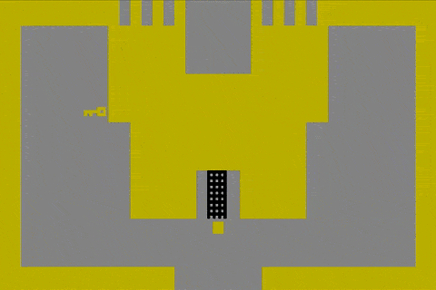

# WELCOME BACK

## Share Environmental Storytelling Homework
Find a partner and take turns sharing your homework. Have something to take notes with. Afterwards, we'll ask for volunteers to share with the class.

After you play, write these things down and discuss with the designer:
- Describe/summarize your experience. 
- Describe anything which stood out (For example: Something that you liked, or that you thought was successful)
- Did you encounter any issues that hindered your experience? (For example: Was anything unclear? Did anything seem unfinished/unresolved? Any other technical issues like choices which didn't work?)

## Early graphical adventure games
In the mid-to-late 80's, one of the most dominant forms of computer game was the graphic adventure game, sometimes also known as _point-and-click_ adventures because of the primary means of interacting with the world.

These games built on the existing genres of text-based adventure games and became incredibly popular as personal computers became more widespread.

Two of the pioneers in this space were Sierra On-Line and LucasFilm Games (aka LucasArts).

## Adventure (1980)
Adventure was an early video game originally conceived as a purely graphical version of Colossal Cave Adventure created by Warren Robinett. It is considered one of the first fantasy adventure games available on a home console. It is considered a predecessor to modern action and role playing video games. 

### Sierra On-Line
Sierra was an early computer game pioneer founded in 1979 by the husband-and-wife duo Ken and Roberta Williams. Originally imagined as an enterprise software company, Sierra went on to become one of the most prolific and financially successful producers of early commercial computer games.

#### Hi-Res Adventure #1: Mystery House, 1980
- The game is a spooky murder mystery that takes place in an abandoned Victorian-era house.
- It was the first adventure game to have full-color graphics in addition to parser-style game play.
- It was a commercial success, initially selling over 15,000 copies via mail order and earning $167,000 (equivalent to $593,000 in 2022). On re-release in 1982, it went on to sell another 60,000 copies!
- The game is inspired by the classic board game Clue and is considered one of the first horror videogames.
- You can play this emulated online [here](https://archive.org/details/Hi-Res_Adventure_1_Mystery_House_1980_On-Line_Systems)

#### King's Quest, 1984
- In this game, you are a knight on a quest to find hidden treasures with the promise of becoming king.
- Arguably, Sierra On-Line's most significant adventure game series.
- It featured 16-color graphics and was the first adventure game to integrate graphical animation into the game world.
- The initial release was controlled completely with textual input.
- It was re-released and repackaged a number of times, each with additional refinements such as mouse support, expanded backstory, and improved graphics.
- You can play an emulated version of the re-released game [here](https://www.retrogames.cz/play_118-DOS.php)
- A copy of the manual is [here](https://www.sierragamers.com/wp-content/uploads/2019/12/Kings_Quest_1_Tech_Ref.pdf) and [here](https://www.sierragamers.com/wp-content/uploads/2019/12/Kings_Quest_1_Manual_1_IBM_Version.pdf)

### LucasFilm Games
LucasFilm Games was founded in 1982 as a videogame development group alongside his film company. In the 1990s, LucasFilm Games (later known as LucasArts) became known as a leading producer of humorous adventure games based on its SCUMM engine. Members of LucasArts' early team went on to form a number of other game companies, most notably Double Fine (Psychonauts, Broken Age)

#### SCUMM
- SCUMM (Script Creation Utility for Maniac Mansion) was a game engine created by Ron Gilbert of LucasArts to simplify to development of graphical adventure games.
- It was created in response to the the King's Quest text parser, which Gilbert did not like.
- The interface originally consisted of roughly 40 different input commands, but ultimately was edited down to 12
- The systems designed with the tool contributed to the particular identifiable feeling of early LucasArts adventure games.

#### Maniac Mansion, 1987
- Maniac Mansion is a comedy-horror adventure game conceived of by Ron Gilbert and Gary Winnick, set in a haunted house and inspired by horror films and B-movie cliches.
- It features nonlinear puzzle design, so that the game can be played through in a variety of different ways. 
- Maniac Mansion was not a huge commercial success, though it is critically acclaimed and widely considered a cult classic in videogames.
- Maniac Mansion introduced a number of innovative ideas into adventure games, including multiple possible endings, user-selectable characters with unique skills, and cut scenes.
- Original game pitch document ([link](https://grumpygamer.com/maniac_mansion_design_doc))
- Ron Gilbert's GDC post-mortem talk ([link](https://www.youtube.com/watch?v=WD64ExGHBWE))

#### Other Notable Games
- [The Secret of Monkey Island](https://www.youtube.com/watch?v=7YnuiM9HOoM), 1990
- [Loom](https://www.youtube.com/watch?v=7o2elJLEWA8), 1990
- [Grim Fandango](https://www.youtube.com/watch?v=kcqj0APsDsM), 1998

## Play Maniac Mansion by LucasArts (1987)
We can play an emulated version online [here](https://playclassic.games/games/point-n-click-adventure-dos-games-online/play-maniac-mansion-online/play/#google_vignette). _Make sure to expand to fullscreen or the mouse will not work!_

## Play Myst (1993)
- This is on the Game Lab PC

### If you need help with this game...
Feeling stuck? [Here](https://mystjourney.com/myst/walkthrough/) is a handy walkthrough that may help.

## Let's talk about MYST

Myst is an adventure video game designed by the Robyn and Rand Miller brothers, Robyn and Rand(Cyan, Inc.), initially released in 1993 for the Macintosh.

It was their first attempt to create a game targeted towards adults, amrking a departure from their earlier work with games like [The Manhole](https://www.youtube.com/watch?v=YyOTq1EpV5o) from 1988.

The game is a first-person exploration featuring nonlinear storytelling, non-violent activity, and environmental puzzle solving developed using [hypercard](https://en.wikipedia.org/wiki/HyperCard), application building software for early Mac computers which didn't require programming that operated something like an interactive stack of cards. 

_Fun fact: Some people are [still making games with Hypercard!](https://www.youtube.com/watch?v=FOyQU0oRvs8&t=9s)_

### Let's watch a talk!
[GDC postmortem talk](https://youtu.be/7cULHgP8tmo?si=GLU1QhZGI6STCv4y) by Robyn Miller (One of the designers of Myst) (36 minutes-ish)

### Legacy

Myst is considered one of the greatest video games ever made. It sold more than 6 million copies and inspired many genres and video game conventions 

- New category of point-and-click adventure games (even Sierra On-line had their own [Myst-like](https://www.youtube.com/watch?v=PrmNgq9EUtY))

- "Casual games" (non-violent, slow paced, gentle puzzle-oriented games) and *escape room games (*the first escape room game was [Crimson Room](https://archive.org/details/crimsonroom_flash) by Toshimitsu Takagi)

- Walking simulators such as [Dear Esther](https://www.thechineseroom.co.uk/games/dear-esther) and the [Stanley Parable](https://www.stanleyparable.com/)

## Worldbuilding Exercise
Over the next two weeks, we'll be doing some related exercises in worldbuilding and character development. We might refer to this as a "world bible". You may choose to use this as the basis for your final project in this class, or not!

This exercise will take a "top down" approach to the worldbuilding, with initial focus on understanding the geography, climate, natural history, resources, and biology (flora and fauna) of the world. Then, we'll continue to zoom in and get an understanding of the cultural history and significant relationships between the world's inhabitants and focus on developing one character that belongs to this fictional society.

For this exerciase you will need:
- Something to create your worldbuilding document (this can either be pen & paper* or a digital text document)
- Something to do a little drawing with (this can also be pen & paper* or some sort of digital drawing tool)

_*If you decide to use pen and paper, you will need to submit a scanned/photographed copy of these documents._ 

# Homework

## Complete Worldbuilding Exercise (Phase 1)

Bring your worldbuilding documents with you to class next week. We will continue to develop them in class.

__You will submit both Phase 1 and Phase 2 of this exercise next week via Canvas.__

## Play NORCO Act One
The entirety of the first act in NORCO is free to play [here](https://store.steampowered.com/app/1221250/NORCO/). You can probably finish it in about an hour.

### Now what?? 
Take notes. What did you like? Dislike? Something that caused a reaction in you? Something you didn't understand? Favorite moments?

__Come to class next week with a an open-ended discussion question related to each of the games you played.__ I'm not collecting these, we'll just be talking.

